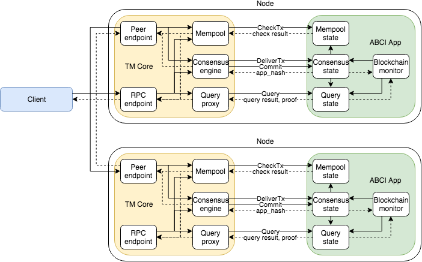

# Tendermint Demo ABCI KVStore on Scala
## Abstract
This is demo application modeling in-memory key-value distributed storage. It allows to store key-value pairs, request them and make some operations with their values. A *distributed* property means that the app might be deployed across several machines (nodes) and tolerant to failures of some subset of those machines. At the same time the client typically interacts with only a single node and the interaction protocol provides some guarantees of availability and consistency.

## Motivation
The application is intented to show a proof-of-concept of a system that provides the following properties:
* Support of arbitrary deterministic operations (including simple reads/writes and complex aggregations, time-consuming calculations etc.)
* Having high throughput (1000 transaction per second) and low latency (1-2 seconds) of operations
* Having every operation response verifiable (and thus trusted by client)
	* Either validated by storing all operation data in the blockchain (in this case such data signed by majority of nodes)
	* Or validated by providing Merkle proofs to the client (in this case the client has all required information to validate the response)
* Ability to restore liveness and even safety after violating typical Byzantine quorum requirements (1/3 of failed nodes and more) – every node could rapidly detect problems in the blockchain or disagreement with the rest of nodes

## Architecture overview
The application use [Tendermint](https://github.com/tendermint/tendermint) platform which provides:
* Distributed transaction cache
* Blockchain (to store transactions persistently)
* Consensus logic (to reach agreement about order of transactions)
* Peer-to-peer communication layer (between nodes)

The application implements Tendermint's [ABCI interface](http://tendermint.readthedocs.io/projects/tools/en/master/abci-spec.html) to follow Tendermint's architecture which decomposes the application logic into 2 main parts:
* Distributed replicated tranasaction log (managed by Tendermint)
* And state machine with business logic (manages by the application itself).

The application is written in Scala 2.12. It is compatible with `Tendermint v0.19.x` and uses `com.github.jtendermint.jabci` for Java ABCI definitions.

It models in-memory key-value string storage. Key here are hierarchical, `/`-separated. This key hierarchy is *merkelized*, so every node stores Merkle hash of its associated value (if present) and its children.



The entire application consists of the following components:
* **Client** proxy (**Proxy**)
* Node Tendermint (**TM** or **TM Core**) with important modules: Mempool, Consensus and Query
* Node ABCI Application itself (**App** or **ABCI App**)

### Operations
Clients typically interact with Fluence via some local **Proxy**. This Proxy might be implemented in any language (because it communicates with TM Core by queries RPC endpoints), for example Scala implementation of *some operation* may look like `def doSomeOperation(req: SomeRequest): SomeResponse`. However this application uses simple (but powerful) Python `query.sh` script as Proxy to perform arbitraty operations, including:
* Write transactions
`tx a/b=10`
* Key read queries
`read a/b`
* Arbitrary operations
`op factorial:a/b`
* Writing results of arbitrary operations
`tx a/c=factorial:a/b`

In terms of Tendermint architecture, these operations implemented in the following way:
* All writes (simple and containing operations) are Tendermint *transactions*: a transaction changes the application state and stored to the blockchain (the correctness ensured by the consensus).
* Reads are Tendermint *ABCI queries*: they do not change the application state, App just return requested value together with Merkle proof (the correctness ensured by Merkle proof).
* Operations are combinations of writes and reads: to perform operation trustfully, Proxy first requests writing the result of operation to some key and then queries its value (the correctness ensured by both the consensus and Merkle proof).

## Installation and run
For single-node run just launch the application:
```bash
sbt run
```
And launch Tendermint in another terminal:
```bash
# uncomment line below to initialize Tendermint
#tendermint init

# uncomment line below to clear all Tendermint data
#tendermint unsafe_reset_all

tendermint node --consensus.create_empty_blocks=false
```

In case Tendermint launched first, it would periodically try to connect the app until the app started. 

After successful launch the client can communicate with application via sending RPC calls to TM Core on local `46678` port.

### Cluster
There are scripts that automate deployment and running 4 Application nodes on local machine.

```bash
node4-init.sh
```
`node4-init.sh` prepares all required configuration files to launch 4-node cluster locally.

```bash
node4-start.sh
```
`node4-start.sh` starts 8 screen instances (`app[1-4]` instances for the app and `tm[1-4]` – for TM Core). Cluster initialization may take some seconds, after that the client can query RPC endpoints on any of `46158`, `46258`, `46358` or `46458` ports.

Other scripts allow to temporarily stop (`node4-stop.sh`), delete (`node4-delete.sh`) and reinitialize (`node4-reset.sh`) the cluster.


## Sending queries

### Transactions

### Simple queries

### Operations


## Implementation details
...

## Dispute cases

### Dispute case 1: honest quorum, some nodes dishonest or not available
TODO

### Dispute case 2: some nodes honest, some not, no quorum
TODO

### Dispute case 2: dishonest quorum, minority of honest nodes

